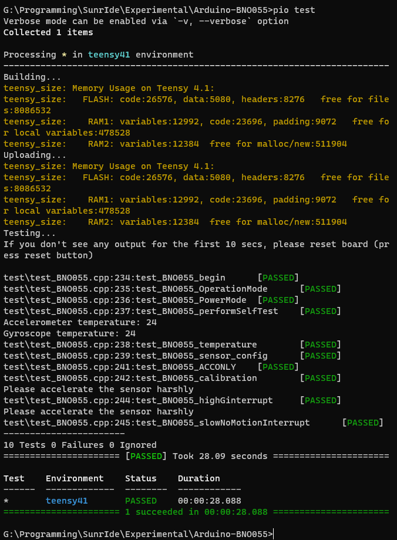

# Arduino BNO055 Library


*image credit: Adafruit*

PlatformIO / Arduino library designed to make it easy to use 
advanced features of the Bosch BNO055 IMU.

Developed by [Tom Danvers](https://github.com/TomD53)

## Features

- Power mode configuration
- Operation mode configuration
- Sensor reset
- Sensor self test
- Methods to read from all operation modes, converted to useful units
- Burst read of all data
- Sensor configuration (set G range, sample rate, power mode - 
this requires reading of the datasheet)
- View sensor calibration
- Implementation of all interrupts
  - `AccelHighGInterrupt`
  - `AccelSlowNoMotionInterrupt`
  - `AccelAnyMotionInterrupt`
  - `GyroHighRateInterrupt`
  - `GyroAnyMotionInterrupt`

## TODO

- Sensor configuration could be improved / made more intuitive. You need to work out what value to write to the 
config register by reading the datasheet.
- Axis remap is not implemented (yet)
- Calibration parameters cannot yet be saved and re-applied after a sensor restart

## Examples

Refer to the [examples directory](examples)

To run an example (in PlatformIO), modify platformio.ini to support your board/framework, and then run the following:

    pio ci "examples/accgyro.cpp" --lib "." -c "platformio.ini"

### Read from accelerometer

```cpp
#include <Arduino.h>
#include "BNO055.h"

const byte I2C_ADDRESS = 0x28;

BNO055 sensor(I2C_ADDRESS, &Wire);

void setup() {
    Wire.begin();
    sensor.begin();
    sensor.setOperationMode(ACCONLY);
}

void loop() {
    Vector<double> accelVector = sensor.getRawAcceleration();
    Serial.println((String)accelVector.getX() + "," + (String)accelVector.getY() + ","
                   + (String)accelVector.getZ() + ",");
}
```

### Register Accelerometer High G interrupt

```cpp
#include <Arduino.h>
#include "BNO055.h"

const byte I2C_ADDRESS = 0x28;

BNO055 sensor(I2C_ADDRESS, &Wire);

// define our callback (known as an ISR, or interrupt service routine) to be called when the interrupt is
// detected. Note that ISRs have various limitations.
void myCallback() {
    digitalWrite(3, !digitalRead(3));
}

void setup() {
    // begin I2C communication
    Wire.begin();

    // reset the sensor to remove any existing configuration
    sensor.resetSystem();

    // we need to be in configmode to set up the interrupt.
    // this is not necessary as we just called sensor#resetSystem however it is here for completeness
    sensor.setOperationMode(CONFIGMODE);

    // define the configuration of our interrupt
    BNO055::AccelHighGInterrupt interrupt(
            sensor,
            (new BNO055::Interrupt::EnabledAxes)->enableX().enableY().enableZ(),
            myCallback,
            2);

    // write the configuration to the BNO055
    interrupt.setup();

    // enable this interrupt
    interrupt.enable();

    // route this interrupt to the INT pin on the sensor
    interrupt.mask();

    // enter the ACCONLY operation mode (note that the above code must run in COMFIGMODE)
    sensor.setOperationMode(ACCONLY);
    pinMode(3, OUTPUT);
}

void loop() {
    // we constantly clear the interrupt on the sensor. Not an ideal solution and not efficient, but
    // works for this example
    sensor.clearInterrupt();
}
```

## Documentation

Most/all methods are documented well in [`BNO055.h`](src/BNO055.h).

Refer to the [examples directory](examples) and also the [unit test](test/test_BNO055.cpp) for usage examples.

The best way of understanding how things work is to [read the datasheet](datasheet.pdf)

## Unit testing

This project contains some automated unit tests that you can run to check that everything works.
You need to do this with PlatformIO.

If you aren't using a Teensy 4.1, modify the configuration in `platformio.ini`

To run the unit tests, run ```pio test```



